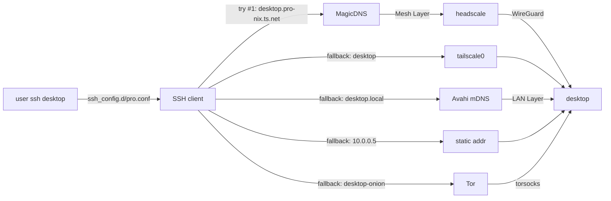

+++
title = "Network layers"
template = "page.html"
weight = 6

[extra]
tldr = "Three independent layers: LAN mDNS (pro-network + pro-peer), mesh (headscale), SSH-нейминг (pro-ssh-clients). SSH has a generated pro.conf that tries candidates in order with per-candidate ConnectTimeout."

[[extra.next]]
title = "Quick start"
url = "/workflow/quickstart/"

[[extra.next]]
title = "Privacy &amp; Tor"
url = "/stack/privacy/"
+++

# Network layers

The project has **three** network layers, each independent, each with
a clear responsibility. They compose without depending on each other.
The SSH-нейминг layer is the only one with a real fallback; the
others are "best effort" within their scope.

| Layer | Module | Transport | Scope |
|-------|--------|-----------|-------|
| **LAN mDNS** | `pro-network.nix` (Avahi + nss-mdns) + `pro-peer.nix` (publishes `_ssh._tcp`) | UDP 5353 multicast | One L2 segment |
| **Mesh** | `headscale.nix` (control plane) + future `pro-tailnet.nix` (clients) | WireGuard | Anywhere with internet |
| **SSH-нейминг** | `pro-ssh-clients.nix` (renders `ssh_config.d/pro.conf`) | SSH on top of whichever candidate wins | Always (whichever layer answers first) |

## Layer 1: LAN mDNS

`modules/pro-network.nix` enables `services.avahi` with `nssmdns4` and
`nssmdns6` set, so `getent hosts <name>.local` resolves to a LAN IP
through the glibc NSS plugin. `nss-mdns` is added to
`environment.systemPackages`.

### The mDNS / resolved conflict

`systemd-resolved` and `avahi-daemon` **must not** both be answering
mDNS queries on the same host. RFC 6762 § 15 describes the resulting
"another mDNS stack" warning, after which Avahi goes into holding
mode and stops publishing DNS-SD records (SSH, SMB, NFS). The
symptom is `avahi-browse -rt _smb._tcp` returning nothing.

The fix is to make `systemd-resolved` stop claiming mDNS:

```nix
services.resolved.extraConfig = lib.mkIf config.services.resolved.enable (lib.mkAfter ''
  MulticastDNS=no
  LLMNR=no
'');
```

`conf/resolved-extra.conf` has the same content as a deployable
config file. The string `MulticastDNS=no` is the right form —
NixOS's option `services.resolved.llmnr` is an enum, but the
`extraConfig` value goes directly to `resolved.conf` and accepts the
string form.

### Avahi publishes SSH

`pro-peer.nix` writes `/etc/avahi/services/ssh.service` with:

```xml
<?xml version="1.0" standalone='no'?>
<!DOCTYPE service-group SYSTEM "avahi-service.dtd">
<service-group>
  <name replace-wildcards="yes">%h</name>
  <service>
    <type>_ssh._tcp</type>
    <port>22</port>
  </service>
</service-group>
```

macOS, iOS, and Android (with Bonjour) can discover the host over
LAN and connect to SSH.

### Firewall

`pro-peer.nix` opens UDP 5353 (mDNS) and adds `iptables`/`ip6tables`
rules for the multicast groups `224.0.0.251` (IPv4) and `ff02::fb`
(IPv6) — the standard mDNS groups. The rules are `lib.mkDefault`, so
a host can override them by setting
`networking.firewall.allowedUDPPorts = []`.

`pro-network.nix` opens `5353/udp` at the same level, with the same
override semantics. The two modules agree by design.

### LAN-gateway role

Hosts with the `lan-gw` role in `pro.hosts` get
`pro.network.allowSubnetRouter = true` (default, computed from the
role). This sets:

* `net.ipv4.ip_forward = 1`
* `net.ipv6.conf.all.forwarding = 1`
* `networking.firewall.trustedInterfaces = [ "tailscale0" ]`
* An `iptables` MASQUERADE on the default route (added with
  `lib.mkBefore` so it is not clobbered by host-local extraCommands).

Only `desktop` has this role. It is the gateway for tailnet clients
that want to reach the internet through a stable uplink.

## Layer 2: Mesh (headscale)

`modules/headscale.nix` is a self-hosted control plane for
Tailscale-compatible WireGuard mesh. The flake pins
`pi.nix` (the user-side client) and `michalrus/opencode-bwrap-nix`
(sandboxing). The control plane options:

```nix
options.headscale = {
  enable        = lib.mkEnableOption "...";
  listenAddress = lib.mkOption { default = "0.0.0.0:8080"; };
  baseDomain    = lib.mkOption { default = "pro-nix.ts.net"; };
  nameservers   = lib.mkOption { default = [ "1.1.1.1" "8.8.8.8" ]; };
  derpUrls      = lib.mkOption { default = []; };
};
```

The base domain is `pro-nix.ts.net` (this is the magic suffix
MagicDNS uses for short names — `desktop` resolves to
`desktop.pro-nix.ts.net`).

### One-host-only invariant

`headscale.enable = true` is the default (in the global
`configuration.nix`). On every laptop / VM, the host's
`configuration.nix` does `lib.mkForce false`:

```nix
# hosts/cf19/configuration.nix
headscale.enable = lib.mkForce false;
# hosts/huawei/configuration.nix
headscale.enable = lib.mkForce false;
# hosts/vm/configuration.nix
# (no headscale.* option exists in this eval)
```

Only `desktop` runs the control plane. Forgetting the `mkForce` on
a laptop would silently start a competing control plane.

### How to register a client

```bash
# On desktop
sudo headscale users create az
sudo headscale preauthkeys create --user az --reusable --expiration 24h
# copy the preauthkey

# On the client (cf19, huawei, …)
sudo tailscale up --login-server http://desktop.local:8080 --authkey=<KEY>
```

After registration, the client's hostname is reachable as
`<host>.pro-nix.ts.net` (MagicDNS) and as `<host>` (short name).

### DERP

`derpUrls = []` by default. For a private DERP, set
`derpUrls = [ "https://my-derp.example.com" ]`. Without a DERP, clients
fall back to the public Tailscale DERP map, which is slow but works.

### The `noise_private.key` pitfall

Headscale generates a `noise_private_key` on first activation. The
`nixos-rebuild switch` flow re-runs the activation, which can
**regenerate** the key — invalidating all existing client sessions.

The fix is to back up the key once and pin it through `local.nix`:

```bash
sudo cp /var/lib/headscale/noise_private.key /etc/headscale/
sudo chmod 0600 /etc/headscale/noise_private.key
```

Then in `local.nix`:

```nix
headscale.settings.noise.private_key = "<base64-from-the-key-file>";
```

## Layer 3: SSH-нейминг

`modules/pro-ssh-clients.nix` generates
`/etc/ssh/ssh_config.d/pro.conf` from the `pro.hosts` registry. One
`Host` block per registered host, with a fixed candidate list:

```nix
candidates = [
  "${h.tailnet}.${tailnetDomain}"   # desktop.pro-nix.ts.net (MagicDNS)
  h.tailnet                          # desktop (short name)
  "${name}.local"                    # desktop.local (mDNS)
]
++ optional (h.addr != null) h.addr       # static IP
++ optional (h.onion != null) h.onion;    # onion (via torsocks)
```

For each `Host` block:

```ssh-config
Host desktop
    User az
    Port 22
    IdentityFile ~/.ssh/id_ed25519
    IdentitiesOnly yes
    PreferredAuthentications publickey
    StrictHostKeyChecking accept-new
    HashKnownHosts yes
    UpdateHostKeys yes
    ServerAliveInterval 30
    ServerAliveCountMax 3
    ConnectTimeout 5
```

Each candidate is its own implicit `HostName` value through the
generated block. The first reachable one wins. With
`ConnectTimeout 5`, a dead `.local` does not block a working
`tailnet-fqdn`.

If a host has an `onion` attribute, a separate
`Host <name>-onion` block is generated with a `ProxyCommand` through
`torsocks`:

```ssh-config
Host desktop-onion
    User az
    HostName <onion-address>.onion
    Port 22
    IdentityFile ~/.ssh/id_ed25519
    IdentitiesOnly yes
    PreferredAuthentications publickey
    ProxyCommand torsocks ssh -W %h:%p
    ConnectTimeout 30
```

The `Match exec` triggers only when the user types
`ssh <name>-onion`, keeping the default `ssh <name>` snappy.

### Configuration options

```nix
pro.sshClient = {
  enable         = lib.mkEnableOption "..." // { default = true; };
  identityFile   = lib.mkOption { default = "~/.ssh/id_ed25519"; };
  connectTimeout = lib.mkOption { default = 5; };  # seconds
};
```

`local.nix` can override:

```nix
pro.sshClient.identityFile = "/home/az/.ssh/id_work";
```

This affects the `IdentityFile` line in every generated `Host` block.

## How the three layers compose



The user types `ssh desktop`. The SSH client reads
`ssh_config.d/pro.conf` and tries the candidates in order. The first
reachable one wins. If all four L2/L3 candidates fail, the
`<name>-onion` candidate is the final fallback — but that requires
explicit invocation (`ssh desktop-onion`).

## Why three layers, not one

A single layer (e.g. mesh) would mean:

* No host reachability when the headscale control plane is down.
* No host reachability when the headscale is reachable but the
  Tailscale daemon is not running on the client.
* No host reachability in a LAN without internet.

The three layers each cover a different failure mode:

* **LAN mDNS** — works in a coffee shop, on a plane (no internet), on
  a corporate network. Fails across VLANs / subnets.
* **Mesh** — works anywhere with internet, NAT-traversal. Fails if
  the control plane is down.
* **Onion** — works anywhere with internet, even from a hostile
  network where the host's IP is being filtered. Slow (3-5x latency).
* **Static addr** — last-resort, requires the user to know the IP.

The SSH candidate list puts the fastest, most-reliable layer first
(magic DNS, if available) and falls back to slower layers.

## Per-host network role

| Host | Role | `pro.network.allowSubnetRouter` | `headscale.enable` | NFS |
|------|------|-------------------------------|---------------------|-----|
| `desktop` | `server, headscale, lan-gw, nfs, tor` | true (default) | true (default) | server (`/srv/nfs`) |
| `cf19` | `laptop, tor` | false | false (mkForce) | client |
| `huawei` | `laptop, tor` | false | false (mkForce) | **disabled** (different subnet) |
| `vm` | `vm, lab` | false | (option does not exist) | client |
